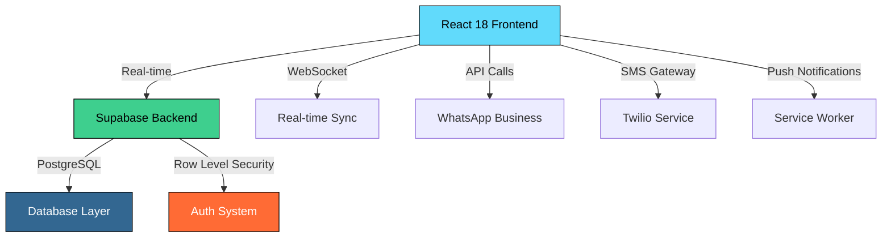

<div align="center">

<!-- Animated Header with Glitch Effect -->


<!-- Matrix-style typing animation -->
[](https://git.io/typing-svg)

<!-- Holographic profile stats -->


</div>

<!-- Animated divider -->


<!-- System Information Display -->
<div align="center">

```ascii
╔══════════════════════════════════════════════════════════════════╗
║                        SYSTEM INFORMATION                        ║
╠══════════════════════════════════════════════════════════════════╣
║                      Location: Colombia 🇨🇴                       ║
║                        Status: Online 🟢                        ║
║                     Architecture: Scalable                       ║
║                   Experience: 1+ Years Active                    ║
    ║                   Specialization: Full Stack                     ║    
╚══════════════════════════════════════════════════════════════════╝
```

</div>

<!-- Interactive Tech Stack with Animated Icons -->
<div align="center">

## ⚡ TECH STACK MATRIX

<!-- Animated skill bars -->


<!-- Progress bars for skills -->


</div>

<!-- 3D Commit Activity -->
<div align="center">

## 📊 NEURAL NETWORK ACTIVITY

<!-- 3D Contribution Graph -->


<!-- Holographic stats display -->
<table>
<tr>
<td>

</td>
<td>

</td>
</tr>
</table>

<!-- Real-time streak with flame effects -->


</div>

<!-- Holographic Project Showcase -->
<div align="center">

## 🚀 FEATURED PROJECT: QUANTUM SYSTEM

<!-- Animated project banner -->


### 💎 **Real-Time Business Management System**

<!-- Tech stack visualization -->


</div>

<!-- System Architecture Diagram -->
<details>
<summary>🔧 <b>SYSTEM ARCHITECTURE</b> (Click to expand quantum details)</summary>



</details>

<!-- Performance Metrics Dashboard -->
<div align="center">

## ⚡ PERFORMANCE METRICS

<table>
<tr>
<td align="center">

<br><sub>Lighthouse Score</sub>
</td>
<td align="center">

<br><sub>Initial Load</sub>
</td>
<td align="center">

<br><sub>Mobile Optimized</sub>
</td>
<td align="center">

<br><sub>System Reliability</sub>
</td>
</tr>
</table>

</div>

<!-- Interactive Feature Matrix -->
<div align="center">

## 🔮 FEATURE MATRIX

<table>
<tr>
<th>🎯 Feature</th>
<th>⚡ Technology</th>
<th>📊 Status</th>
<th>🚀 Performance</th>
</tr>
<tr>
<td>🔐 Authentication</td>
<td>Supabase + SMS/WhatsApp</td>
<td></td>
<td></td>
</tr>
<tr>
<td>📱 Mobile UI</td>
<td>React + Tailwind CSS</td>
<td></td>
<td></td>
</tr>
<tr>
<td>⚡ Real-time Sync</td>
<td>Supabase Subscriptions</td>
<td></td>
<td></td>
</tr>
<tr>
<td>📲 Notifications</td>
<td>WhatsApp + Push API</td>
<td></td>
<td></td>
</tr>
</table>

</div>

<!-- Animated Contact Section -->
<div align="center">

## 📡 ESTABLISH CONNECTION

<!-- Glowing contact badges -->
<a href="https://linkedin.com/in/deibyd07">

</a>
<a href="mailto:deibyd07@gmail.com">

</a>
<a href="https://wa.me/573168134245">

</a>

<!-- Live status indicators -->


</div>

<!-- Terminal-style footer -->
<div align="center">

```bash
$ whoami
dealcag0723@gmail.com:~$ Developer | React | Mobile-First 

$ uptime
System online: 1+ years | Projects deployed: 10+ | Bugs eliminated: ∞

$ status
💚 Available for hire | 🚀 Ready for challenges | ⚡ Response time: Lightning fast
```

<!-- Animated snake eating commits -->


<!-- Profile view counter with holographic effect -->


<!-- Matrix-style ending -->
```
⚡ System.exit("Thanks for visiting the matrix") ⚡
```

</div>

<!-- Animated footer -->

